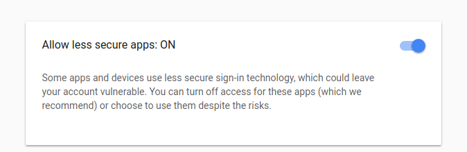

# How to configure email sending in Laravel #

## GMAIL ##

1. Create/have a gmail account
1. Authorize less secure applications on [https://myaccount.google.com/security](https://myaccount.google.com/security) 
1. Make sure you are **not** running the application with the key APP_ENV equals to **local** or **development**  in .env file (in this cases the emails are redirected to log file)
1. Configure the smtp section in .env file as follows:

```config
# SMTP Mail server credentials
MAIL_DRIVER=smtp
MAIL_HOST=smtp.gmail.com
MAIL_PORT=587
MAIL_USERNAME=username@gmail.com
MAIL_PASSWORD=your-password
MAIL_ENCRYPTION=tls
```

After changing it, run on the application server:

```sh
php artisan config:cache
```

In same cases it is required to restart the services:

```sh
docker-compose restart
```