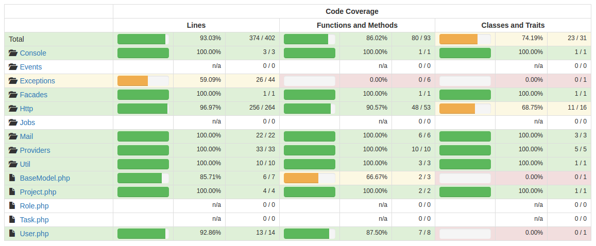

# DryPack Framework #

This is the DryPack, a web Framework and it is intended to be used as a base for web applications, avoiding the need of creating already common features and automatons that are part of most of modern web applications. The idea is that developer just write the code related to the business needs and in a simple and clean way. The Framework name is inspired in the Don't Repeat Yourself principle.
We are trying to make our best, but of course you are very welcomed to make suggestions and contributions.

## About ##

This project is based in Laravel, a collection of community and custom components and customs front-end for admin and client with AngularJS. It tries to encompass the right components in harmony to get an out-the-box, decoupled, easy to use/develop, RESTful architectural style and fully functional web framework.

## Sections ##

- [Features](#features)
- [Requirements](#requirements)
- [Components and Frameworks used](#components-and-frameworks-used)
- [Getting, configuring and running](#getting-configuring-and-running)
- [Repository workflow practices recommendation](#repository-workflow-practices-recommendation)
- [Installation](#installation)
- [Configuring the project](#configuring-the-project)
- [Running the project](#running-the-project)
- [Code verification](#code-verification)
- [Automated tests](#automated-tests)
- [Get new features and updates from DryPack](#get-new-features-and-updates-from-drypack)
- [Log viewer](#log)
- [Scripts and commands](#scripts-and-commands)
- [Development](#development)
  - [Internationalization](#internationalization)
  - [Editor](#editor)
  - [Debugging back-end with XDebug](#debugging-back-end-with-xdebug)
  - [Code generators](#code-generators)
  - [Dynamic Permissions](#dynamic-permissions)
  - [How to use GenericService](#how-to-use-genericservice)
  - [Easy CRUD](#easy-crud)
  - [Attributes format](attributes-format)
  - [Making a specific validation](making-a-specific-validation)
- [Deploy](#deploy)
- [Contributing to the DryPack](#contributing-to-the-drypack)
- [Additional READMEs](#additional-readmes)

## Features ##

It is included in the DryPack the following features: 

- Based on [Laravel 5.6.*](https://laravel.com/docs/5.5)
- One single command to setup the whole solution!
- One single command to deploy the whole solution!
- AngularJS 1.6.4 framework in the front-ends (admin and public client)
- For authentication it is used [JWT](http://jwt.io) with the component [tymon/jwt-auth](https://github.com/tymondesigns/jwt-auth)
- Docker Container with all the requirements and ready to use - see [PHP Docker](docker/readme.md);
- Complete cycle of authentication/authorization including permissions, roles and user management
- Authentication via [JWT](http://jwt.io), dismissing the use of session/cookie
- Dynamic Permissions with request interception (manageable via administration, allowing assigning roles and permissions for users)
- [Developer Log Viewer](https://github.com/ARCANEDEV/LogViewer/) to see application logs in a nice way 
- A Generic Service to serve queryable data with few lines of code
- CRUD encapsulation with **CrudController** easing the creation of CRUD
- Code generator for back-end and front-end
- Tasks automation (run, build, check, deploy, test)
- Tests automation infrastructure for your business tests
- Api test coverage of more than 90%
- Deploy package generator
- Auto sending/installation via FTP
- Easy and flexible CRUD structure with triggers and callbacks
- Dynamic Query feature, allowing you to inspect data easily
- Automatic saving of data change for audit [Laravel Auditing](https://github.com/owen-it/laravel-auditing)
- Samples to demonstrate how to use this framework
- Use of [Angular Model Factory](https://github.com/swimlane/angular-model-factory) pattern in front-end
- Use of Feature-by-Folder pattern
- Live multi Language in back and front-end
- Sending of batch HTML e-mails tool
- Integration with [Angular Admin](https://gitlab.com/drypack/front-end-admin);
- Integration with [Angular Client](https://gitlab.com/drypack/front-end-client);
- Integration with [C2YoGenerator](git@gitlab.com:drypack/c2yogenerator.git);
- Code well documented and READMEs
- Gitlab CI integration to auto test the application

## Requirements ##

**Attention: if you decide to use Windows, you must use the [Docker environment](docker/readme.md).**

**If you are using the [Docker environment](docs/readme-install-docker.md), all the requirements are satisfied by the docker container.**

To run to work with the DryPack, it is needed:

- Non blocked/restricted access to Internet so that the dependencies can be download automatically.
- Debian compatible distro with APT (Ubuntu recommended)
- Most recent version of [GIT](https://git-scm.com/book/en/v2/Getting-Started-Installing-Git).

*Docker Engine, Docker Compose and Docker Machine will be automatically installed if not present* - [see Docker readme](#docker/readme.md)

It also recommended the usage of a modern editor, like [Visual Studio Code](https://code.visualstudio.com/).

## Components and Frameworks used ##

- Automation for environment/app setup and deploy
- [JWT](http://jwt.io)
- [Tymon/jwt-auth](https://github.com/tymondesigns/jwt-auth)
- [Developer Log Viewer](https://github.com/ARCANEDEV/LogViewer/)
- [Laravel Auditing](https://github.com/owen-it/laravel-auditing)
- [CRUD Controller](https://github.com/jamierumbelow/crudcontroller)
- Dynamic Query (by DryPack)
- [Generic Service](docs/how-to-use-generic-service.md) (by DryPack)
- [Angular Admin](https://gitlab.com/drypack/front-end-admin) (by DryPack)
- [Angular Client](https://gitlab.com/drypack/front-end-client) (by DryPack)
- [Angular Model Factory](https://github.com/swimlane/angular-model-factory)
- [C2YoGenerator](git@gitlab.com:drypack/c2yogenerator.git) (by DryPack)
- [AngularJS](https://angularjs.org)
- [Angular Material](https://material.angularjs.org)
- [NgC2lib](git@gitlab.com:drypack/ngc2lib.git) (by DryPack)
- [MomentJS](http://momentjs.com/)

## Getting, configuring and running ##

Clone the repository locally:

```sh
git clone -b master git@gitlab.com:drypack/main.git {project-name}
```

Only one line of command is necessary to check/install docker engine, check/create docker image, clone/download admin and client, install dependencies, seed the database, build and run. We have automated everything!

To configure the project run:

The command below will install docker engine (if it is not installed), create the drypack image (if it does not  exist), configure the project, build the front-ends and run the server.

```sh
cd {project_root_folder} && sh scripts/configure.sh -g git@gitlab.com:your-project-repository.git # "-g <repo>" is optional, but recommended
```

OR if the you are configuring an existing and on development project, that is not stored in DryPack repo, run:

```sh
cd {project_root_folder} && sh scripts/configure.sh -e 
```

After run the configure script, *all the commands documented must be executed inside the Docker  container bash*

If you get any error related to docker engine installation while running configure.sh, check [Docker install issue](docs/common-errors.md#docker-installation-error-when-running-configure)

## Repository workflow practices recommendation ##

The repository workflow for the project have the branches:

- master (where the stable/production versions are stored)
- develop (where the working versions are stored)
- feature/feature-name (local only branches of a working feature)

When somebody is working on a feature, this person should create a local branch. This local branch should be named 'feature/feature-name'. When the developer ends and tests the feature, he/she should commit it in the 'feature/feature-name', check out in the 'develop' branch, pull it from the server, make a merge from 'feature/feature-name' and then push this. In general cases, the branch 'feature/feature-name' should exist only in the local repository.

When a version is about to be released to the client, it should receive a tag with the version number.

*Only when a version is approved to go the production server, we check out in the 'master' branch and make a merge from the branch 'develop'.*

### Manual installation without Docker (not recommended) ###

- To create the environment follow the instructions in [README install requirements manually](docs/install-requirements-manually.md).
- Create an **.env** file from **env.example** and check if the **.env** has the right configuration/credentials for the database, e-mail, ftp and etc.
- Then copy/adapt and run manually the commands/steps in scripts/configure.sh

## Running the project ##

*Important:* in the .env file you can define some configurations/behavior

To run the project in another moment do the following:

*Remember: the run once configure.sh script runs the project after configuring it*

- Run the command below to process the **.sass** files and concatenate the **.js** and **.css** injecting them into **index.html**.
- The command keep watching modifications in the file system and repeats the process automatically

```sh
# remember, it is needed to be in the docker bash
# to run this command if you are using Docker
cd {project_root_folder}
npm run build
```

- In another tab/terminal window run the command to start the back-end php server on the port 5000 :

```sh
# remember, it is needed to be in the docker bash
# to run this command if you are using Docker
cd {project_root_folder}
npm run server
```

- Point your browser to **http://localhost:5000** and enter the default credentials:
  - e-mail/username: **admin@drypack.com**
  - password: **drypack01**

## Code verification ##

```sh
# remember, it is needed to be in the docker bash
# to run this command if you are using Docker
cd {project_root_folder}
npm run check
```

- Verifies the javascript formatting standards
  - optional parameter
    - **--fix** (to fix the errors that can be fixed automatically)

## Automated tests ##

### Current coverage ###



### Test configuration ###

- The test database must be already set if you are using Docker or if you ran the manual configuration.
- In the tests, it is used data from the seed/fake class.

### Running the tests ###

#### Tests e2e (end to end) ####

- In a terminal run the commands:

```sh
# remember, it is needed to be in the docker bash 
# to run this command if you are using Docker
# to go inside the container run: "docker exec -it --user root drypack-container bash"
cd {project_root_folder}
npm run webdriver
```

- In another terminal, run the commands below:

```sh
# remember, it is needed to be in the docker bash 
# to run this command if you are using Docker
# to go inside the container run: "docker exec -it --user root drypack-container bash"
cd {project_root_folder}
npm run e2e-test
```

#### Unit tests ####

- In a terminal run the commands:

```sh
# remember, it is needed to be in the docker bash 
# to run this command if you are using Docker
# to go inside the container run: "docker exec -it --user root drypack-container bash"
cd {project_root_folder}
npm run php-test
```

## Get new features and updates from DryPack ##

- The commands below merge the files but keep them in the stage area, so you can commit or discard the changes.

### Merge with DryPack ###

```sh
cd {project_root_folder}
git fetch drypack
git merge drypack/develop --squash --no-commit
# this command the merge stay pending, waiting confirmation with a commit
```

## Log ##

To see the logs in the developer viewer

- Go to [http://localhost:5000/developer/log-viewer](http://localhost:5000/developer/log-viewer)
- Type the username and password according what is in the .env DEVELOPER_ID and DEVELOPER

## Scripts and commands ##

- All the scripts and commands must be ran in the project root folder

### Scripts ###

- sh scripts/configure.sh
- sh scripts/configure-contribute.sh
- sh scripts/e2e-test.sh
- sh scripts/php-test.sh

### commands ###

- npm run server
- npm run package
- npm run build
- npm run check
- npm run webdriver
- npm run e2e-test
- npm run unit-test

## Development ##

### Internationalization ###

The DryPack is fully internationalized, so it can be used with different/multiple locales and the locale can even be changed on the fly. 
The resources/config for two locales are already included: en-US and pt-BR. Of course you can add resources/config for other locales.

Talking about the full application (front-end and back-end) the app will try to auto-select the user locale based in the user's browser
locale. If the user's browser locale is not supported, then the default locale will de be selected. Originally, the default locale is
en-US, but you can also change it.

**Changing the default locale:**

- *In the back-end*: change the value of *DEFAULT_LOCALE* in the .env* file(s).
- *In the front-end admin*: change the value of *defaultLocale* in *public/admin/app/app.global.js* and include the defined default locale angular file in gulpfile.js paths.angularScripts.

*Important:*

- you must change in both: front and-back end to see it working
- make sure that the locale being defined as default is already added. See the step below!
- Reload and recompile the front-end (stop/start gulp task) the application so it can take effect

**Adding a new locale:**

- *In the back-end*:
  - add the desired locale in the *config/i18n.php*
  - create a folder in *resources/lang/* with the identification of your locale (eg.:de-DE)
  - copy the all the files from 8resources/lang/en-US8* to your new locale folder
  - open each file copied in your new folder and translate the contents

- *In the front-end admin*:
  - add the desired locale in the *locales* array in *public/admin/app/app.global.js*
  - create a folder in *public/admin/app/i18n* with the identification of your locale (eg.:de-DE)
  - copy the all the files from *public/admin/app/i18n/en-US* to your new locale folder
  - open each file copied in your new folder and replace en-US in 'en-US.i18n.' by your locale id, like 'de-DE.i18n.'
  - open each file copied in your new folder and translate the contents

- *In the front-end client*:
  - add the desired locale in the *locales* array in *public/client/app/app.global.js*
  - create a folder in *public/client/app/i18n* with the identification of your locale (eg.:de-DE)
  - copy the all the files from *public/client/app/i18n/en-US* to your new locale folder
  - open each file copied in your new folder and replace en-US in 'en-US.i18n.' by your locale id, like 'de-DE.i18n.'
  - open each file copied in your new folder and translate the contents

  *Important:*
  - You need to add in both: front and back end to see it working
  - After doing this, stop the gulp task and start again
  - Reload the application so it can take effect

### Editor ###

- [vscode](https://code.visualstudio.com/)
  - plugins used:
    - php debug
    - php code format
    - eslint (to identify formatting errors and code smells)
    - editor config (to configure codification, tabulation ...)
    - beautify (to format the code)
    - vscode-icons
    - auto close tag
    - path intellisense (auto complete para php)
    - auto close tag

### Debugging back-end with XDebug ###

We can debug our source code using Xdebug component, that is already installed in the Docker image. To do so, you need to use an editor/IDE that supports a XDebug plug-in. We do recommend [VSCode](https://code.visualstudio.com/Download). It's really a great tool and works on Linux, Windows and Mac.

The xdebug.remote_host is by default configured to be 172.17.0.1, which points to the host machine.

So, you just need to configure the debug in you IDE/Text editor. If you are using VSCode:

- Press F1, type *ext install php-debug* and hit enter.
- After that just, click in the debug icon in the left side bar, then click in the gear, select PHP. Be sure that your launcher.json file has the following content:

```json
{
  "version": "0.2.0",
  "configurations": [
    {
      "name": "Listen for XDebug",
      "type": "php",
      "request": "launch",
      "port": 9000,
      "pathMappings": {
        "/var/www":"${workspaceRoot}/"
      }
    },
    {
      "name": "Launch currently open script",
      "type": "php",
      "request": "launch",
      "program": "${file}",
      "cwd": "${fileDirname}",
      "port": 9000
    }
  ]
}
```

 Save the launcher.json. Restart VSCode.

To debug a source code just open a .php file, click before the line number (in the left side) and run some request/url that should execute this php file.

#### If debug does not work ####

- Stop/start the docker container
- Close/open the VSCode/IDE

### Code generator ###

- install c2yogenerator
  - run "sudo npm install -g https://gitlab.com/drypack/c2yogenerator"
- Use the feature-by-folder structure generator to generate the necessary files to a new resource
- In the web app root folder run:

```sh
cd {web_app_root_folder}
yo c2generator
```

- Choose a structure in the list
- type the resource name

**For more information about how to use the generator go to [Generator C2yoGenerator](git@gitlab.com:drypack/c2yogenerator.git);**

> To generate the structure in the back-end, use the following commands:

- Complete structure

```sh
php artisan crud:generate {Resource} --fields="{field_1}#string; {field_2}#text;" --controller-namespace={Resource} --route-group={groupName}
```

- Controller

```sh
php artisan crud:controller {Resource}Controller --crud-name={resource} --model-name={Resource} --route-group={resource}
```

- Model

```sh
php artisan crud:model {Resource} --fillable="['{field_1}', '{field_2}']"
```

- Migration

```sh
php artisan crud:migration {resource} --schema="{field_1}#string; {field_2}#text"
```

> Obs.: After creating the complete structure or a migration, access the created migration file
> inside the folder database > migrations and remove the line **$table->timestamps()** and add the lines below:

```php
$table->timestampTz('created_at');
$table->timestampTz('updated_at');
```

> Af run the command below to apply the migration(s) in the database

```sh
php artisan migrate
```

*If necessary, add a new route in the file **routes/api.php***

**To know more about the generator usage see [CRUD Generator](https://github.com/appzcoder/crud-generator#commands)**

### Dynamic Permissions ###

The dynamic permission intercepts all the requests and evaluate if the current user (include an anonymous one) has the permission to run an action over a controller. as each controller must represent an resource, it is treated in the documentation as 'resource' in the context of the dynamic permission.

The definitions about the actions available for each resource is stored in config/authorization.php. It is an array and you can add your custom definitions. The definitions about which role can do which action is stored in the database and managed in the application roles page.

*Every time you change the definitions about the available actions and resources you must update the database.*

To do it, run:

```php
# in the docker container prompt:
npm run reset-actions
```

If you want to redefine the default user actions/roles, run:

```php
# in the docker container prompt:
npm run seed-users-roles
```

*Important:* Internally **reset-actions** calls **seed-users-roles**

### Conventions ###

We do recommend that you use the generators (for back and front-end) so you follow easily the project standards.

### How to use GenericService ###

Read the [GenericService how to use README](docs/how-to-use-generic-service.md)

> ### Easy CRUD ###

**CrudController.php** (app/Http/controllers/CrudController.php)

- To inherit the CRUDController the inheriting controller must be like this:

```php
use App\Http\Controllers\CrudController;

class {CONTROLLER_NAME} extends CrudController
```

- The following methods MUST be implemented:

```php
getModel() // returns the model class managed by the controller
getValidationRules(Request $request, Model $obj) // returns an array with the validation rules
```

- Implemented actions

```php
index(Request $request)
store(Request $request)
show(Request $request, $id)
update(Request $request, $id)
saveOrUpdate(Request $request, $obj, $action)
destroy(Request $request, $id)
```

- Hooks

```php
applyFilters(page, $request, $baseQuery)
beforeAll($request)
beforeSearch($request, $dataQuery, $countQuery)
beforeSave($request, $obj)
beforeStore($request, $obj)
beforeUpdate($request, $obj)
beforeDestroy($request, $obj)
afterSave($request, $obj)
afterStore($request, $obj)
afterUpdate($request, $obj)
afterDestroy($request, $obj)
```

- Example

```php
class ProjectsController extends CrudController
{
    public function __construct()
    {
    }

    protected function getModel()
    {
        return {MODEL}::class;
    }

    protected function applyFilters(Request $request, $query) {
        $query = $query->with('{relationship}');

        if($request->has('name'))
            $query = $query->where('name', 'like', '%'.$request->name.'%');
    }

    protected function beforeSearch(Request $request, $dataQuery, $countQuery) {
        $dataQuery->orderBy('name', 'asc');
    }

    protected function getValidationRules(Request $request, Model $obj)
    {
        $rules = [
            'name' => 'required|max:100|unique:{resource}'
        ];

        if ( strpos($request->route()->getName(), '{resource}.update') !== false ) {
            $rules['name'] = 'required|max:255|unique:{resource},name,'.$obj->id;
        }

        return $rules;
    }
}
```

### Attributes format ###

To format the attributes in the back-end side, it must be added a cast in the model cast array in the model constructor
like in the example below:

```php
public function __construct($attributes = array())
{
    parent::__construct($attributes);

    $this->addCast(['user_id' => 'integer']);
}
```

Obs.: except for dates, that are already formatted. Errors can occur it the pattern is modified.

### Making a specific validation ###

At any action in the CrudController it is possible to add specific validations returning what is expected: 

```php
  $this->validate($request, []);

  if($object->owner_id !== Auth::id()) {
      $this->validator->errors()->add('owner', 'This resource is not yours');
      $this->throwValidationException($request, $this->validator);
  }
```

## Deploy ##

The DryPack comes with a deploy command line utility that allows to build/pack/send/install the application
with a single command!

```sh
# in the docker container prompt:
artisan deploy:run --env=development --install --migrate --seed
# this will build, pack, deploy, install, run migrations and seed on the development environment
```

**Important:** to be able to to deploy, it is necessary to define the the FTP credentials, DEPLOY_TARGET server in the corresponding .env file (like env.development or env.production), set the app root folder on the remote server in the fle [Envoy.blade.php](Envoy.blade.php) and [add your ssh key on the remote server](#add-key-remote-ssh.md)

Full list of commands and options:

* Build and pack the application (back and front-end)

  ```sh
  # in the docker container prompt:
  deploy:pack {--no-zip} {--rm-samples}
  # both options are boolean, so, you don't need to pass a value  
  # The default --strategy used by deploy:run to build the font-ends is "angular1"
  ```

* Extract/build only a front-end

  ```sh
  # in the docker container prompt:
  deploy:front-end {--client=} {--strategy=} {--env=} {--out-folder=} {--rm-samples}
  # example:
  # deploy:front-end --client=admin --strategy=angular1 --env=development --out-folder=package/app
  ```

* Send

  ```sh
  # in the docker container prompt:
  deploy:send {--single-file=}
  # without options send the default set of files to install on a remote server, 
  # with --single-file option allow to send a specific file to the server
  ```

* Build, pack, send and install (back and front-end)

  ```sh
  # in the docker container prompt:
  deploy:run {--no-zip} {--send} {--install} {--rm-samples} {--migrate} {--seed}
  # Internally the deploy command calls the deploy:pack and deploy:send and also
  # run the installer remotely, using Laravel envoy
  # The default --strategy used by deploy:run to build the font-ends is "angular1"
  ```


## Contributing to the DryPack ##

- Access the doc [How to contribute with the DryPack](/docs/how-to-contribute.md)

## Additional READMEs ##

- [Changelog](docs/changelog.md)
- [How to install/configure Docker](docker/readme.md)
- [Install requirements manually](docs/install-requirements-manually.md)
- [Admin front-end](public/admin/readme.md)
- [Client front-end](public/client/readme.md)
- [How to use Generic Service](docs/how-to-use-generic-service.md)
- [How to contribute](docs/how-to-contribute.md)
- [Code snippets](docs/code-snippets.md)
- [Commands](docs/commands.md)
- [Common errors](docs/common-errors.md)
- [How to add a key to a remote server](docs/add-key-remote-ssh.md)
- [Configure reverse proxy on apache](docs/configure-apache-reverse-proxy.md)
- [Configure e-mail sending](docs/configure-email-sending.md)
- [Configure sftp](docs/configure-sftp.md)